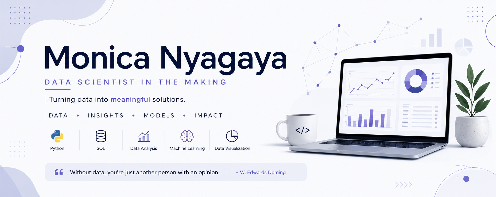

## About Me

I am an aspiring Data Scientist, passionate about transforming raw data into insights. 

 I have a background in UX/UI design, Web Content Development, and Business Development, and Hospitality & Tourism Management.

🔭 Currently working on various end-to-end data science projects. 

🌱 I hope to collaborate and expand my knowledge of machine learning, statistical modeling, feature engineering, model optimization, and big-data technologies.
